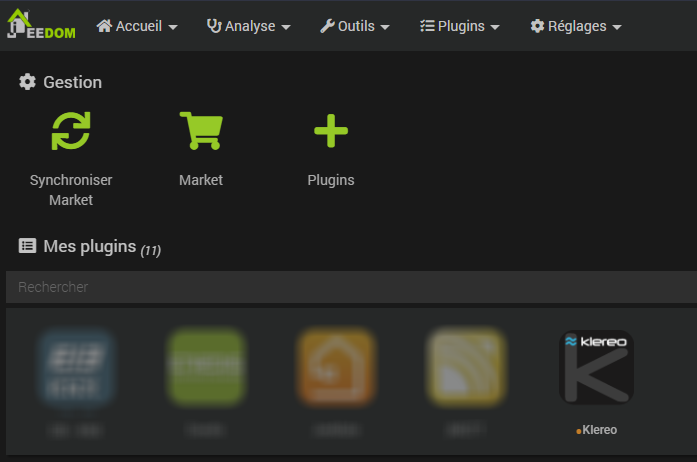
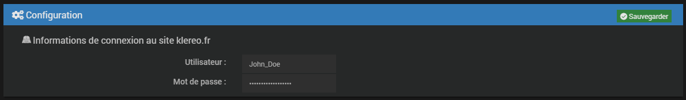

# Présentation du plugin Klereo (bêta)

> :memo: ***Remarque***  
> Il s'agit de la documentation du plugin en version bêta. Les fonctionnalitées à venir sont listées dans la todo-liste
> au début du changelog et ne sont donc pas évoquées ici.

Le plugin Klereo permet de gérer son bassin connecté avec la box Klereo connect avec Jeedom. Analogiquement au [site
officiel](https://connect.klereo.fr/v3) et si l'équipement de l'installation le permet, le plugin donne accès :
- aux différentes mesures,
- aux informations de l'installation,
- à la consigne de chauffage,
- éventuellement aux consignes de pH, de redox et de chlore selon vos droits d'accès,
- au contrôle de la filtration,
- au contrôle de l'éclairage du bassin,
- au contrôle des sorties auxiliaires.

Le plugin Klereo peut donc être utile au propriétaire du bassin comme au pisciniste. Le pisciniste a la possibilité de
créer un équipement par bassin auquel il a accès.

***

# Utilisation

Une fois le plugin installé depuis le market, il faut configurer votre accès à l'API. Il s'agit de l'identifiant et du
mot de passe qui vous servent à vous connecter au [site officiel](https://connect.klereo.fr/v3). Ces informations sont
à renseigner dans la configuration du plugin via le menu Plugins / Gestion des plugins puis sur le plugin Klereo :  

Là, vous devez remplir les informations de connexion :  

Attention à bien cliquer sur le bouton  sans quoi votre saisie ne sera pas
sauvegardée.  
Le fait de sauvegarder les identifiants réinitialise le plugin complet. Tous les équipements et toutes les commandes du
plugin sont effacées sans qu'une validation soit demandée, alors soyez prudent. Tout de suite après l'installation du
plugin, cela n'a pas d'incidence puisqu'aucun équipement n'est présent.

Il faut ensuite créer un équipement pour votre bassin. La sauvegarde de l'équipement déclanche la création automatique
des commandes qui permettent de connaître et de modifier l'état de fonctionnement du bassin.

# Le principe

Un équipement de plugin correspond à un bassin. En fonction des mesures gérées par votre coffret Klereo, du type
des équipements installés et de vos droits d'accès, les commandes info et action nécessaires et possibles sont
automatiquement créées au moment de la sauvegarde de l'équipement. Il faut donc choisir quel à bassin est associé
l'équipement, activer l'équipement et le sauvegarder.

Les données sont actualisées toutes les 10 minutes, une actualisation manuelle peut être demandée. Les données sont
également actualisées immédiatement après l'exécution d'une commande action afin de raffraichir l'état du bassin dans
Jeedom.

Le nom de toutes les commandes peut être personnalisé. Mais il n'est pas possible d'ajouter ou de supprimer des
commandes manuellement. L'ordre des commandes peut également être modifié sans que cela ne change le fonctionnement du
plugin. Si des commandes sont supprimées de la base de données, elles seront recréées lors de la sauvegarde de
l'équipement.

La plage (valeurs min. et max.) des commandes info numériques s'adapte automatiquement à la valeur mesurée afin de ne
pas générer d'erreur et de permettre à Jeedom d'afficher toutes les mesures. La plage peut être personnalisée.
Toutefois si elle n'est pas adaptée à une mesure faite, le plugin la modifiera.

# Les commandes info

Pour chaque mesure, une commande 'instantanée' et 'en filtration' est créée. Les commandes 'en filtration' ne sont
actualisées par l'API que lorsque la filtration est active. Le plugin ne fait qu'afficher les valeurs fournies par
l'API, aucun traitement ou calcul n'est fait.

Sont aussi communiquées, le cas échéant :
- la durée de filtration du jour,
- la durée de filtration total,
- la consommation de pH-minus du jour,
- la consommation de pH-minus totale,
- la production journalière de chlore par électrolyse,
- la consommation de chlore liquide du jour,
- la consommation de chlore liquide totale,
- la durée d'injection de chlore liquide du jour,
- la durée d'injection de chlore liquide totale,
- la consommation de chlore du jour,
- la consommation de chlore totale,
- la durée de chauffage du jour,
- la durée de chauffage total.

Les informations techniques sur le bassin suivantes sont également communiquées :
- le mode de régulation,
- le type de désinfectant,
- le type de correcteur de pH,
- le type de chauffage,
- le niveau d'accès de l'utilisateur,
- la gamme de produit,
- le type de pompe de filtration,
- la gamme d'électrolyseur.

Le nombre et le détail des alertes du bassin sont les valeurs de deux commandes. S'il y a plusieurs alertes, les
messages d'alerte sont séparés par des '\|\|'.

# Les commandes action

Chaque commande action est liée à une commande info afin que la valeur initiale corresponde à la valeur effective.
Cette paire de commandes est nommée 'paire de commandes info+action' dans cette documentation.

## Les consignes

Les bassins Klereo ont quatres consignes possibles :
- la consigne de chauffage modifiable par tous les utilisateurs si un système de chauffage est installé,
- les consignes de pH, de Redox et de chlore ne sont modifiables que par les utilisateurs ayant un accès "utilisateur
  avancé", le pisciniste ou le support Klereo si le bassin est équipé d'un système de régulation pour ces valeurs.

## Les sorties

Pour toutes les sorties, une commande info reflétant l'état de la sortie est créée, même pour les sorties suivantes
pour lesquelles seul l'état de la sortie est disponible :
- correcteur de pH,
- désinfectant,
- floculant,
- désinfectant hybride.

Pour la filtration, les paires de commandes info+action suivantes sont créées :
- 'OFF' : verrou qui lorsqu'il vaut '1' empêche le plugin de piloter la sortie,
- 'ON' : commande de marche manuelle pour une pompe on/off,
- 'Consigne' : consigne de vitesse manuelle pour une pompe à plusieurs vitesses,
- 'Plage' : pour piloter la filtration selon les plages horaires définies,
- 'Régulation' : les plages et durées de filtration seront calculées dynamiquement en fonction des paramètres et des
  capteurs du bassin.

Pour les sorties éclairage et auxiliaires, les paires de commandes info+action suivantes sont créées :
- 'OFF': verrou qui lorsqu'il vaut '1' empêche le plugin de piloter la sortie,
- 'ON' : commande de marche manuelle,
- 'Temps de minuterie' : durée (en minutes) durant laquelle la sortie est activée lorsque la commande 'Minuterie' est
  envoyée,
- 'Minuterie' : pour piloter la sortie durant le temps configuré si la commande 'ON' vaut '0',
- 'Plage' : pour piloter la sortie selon les plages horaires définies si les commandes 'ON' et 'Minuterie' valent '0'.

Pour le chauffage, les paires de commandes info+action suivantes sont créées :
- 'OFF': verrou qui lorsqu'il vaut '1' empêche le plugin de piloter la sortie,
- 'Régulation' : commande qui peut prendre la valeur :
  - 0 : 'Arrêt' : le chauffage est éteint,
  - 1 : 'Automatique' : l'API contrôle le mode refroidissement ou chauffage en fonction de la consigne et de la
    température du bassin,
  - 2 : 'Refroidissement' : l'appareil gérant la température ne fonctionne que en refroidissement,
  - 3 : 'Chauffage' : l'appareil gérant la température ne fonctionne que en chauffage.

> :memo: ***Remarque***  
> Les modes 'Automatique' et 'Refroidissement' ne sont permis par le plugin que sur les types de chauffage avec pompe
> à chaleur.

### Exemple pour la filtration

En résumé, pour la filtration, les commandes suivantes sont créées :
- 'Filtration état' : représente l'état de la pompe quel que soit le mode,
- 'Filtration OFF état' : représente l'état du verrou. Ce verrou est modifiable avec la commande action 'Filtration
  OFF CMD',
- 'Filtration OFF CMD' : commande action permettant de modifier le verrou,
- 'Filtration ON état' : représente l'état de la commande manuelle. La commande manuelle est modifiable avec la
  commande action 'Filtration ON CMD',
- 'Filtration ON CMD' : commande action permettant de modifier le pilotage manuel de la pompe,
- 'Filtration Plage état' : représente l'état du mode de pilotage selon les plages horaires. Le pilotage 'Plage' est
  modifiable avec la commande action 'Filtration Plage CMD',
- 'Filtration Plage CMD' : commande action permettant de modifier le pilotage de la pompe selon les plages horaires
  définies sur le site Klereo,
- 'Filtration Régulation état' : représente l'état du mode de pilotage régulé. Le pilotage régulé est modifiable avec
  la commande action 'Filtration Régulation CMD',
- 'Filtration Régulation CMD' : commande action permettant de modifier le pilotage de la pompe selon la régulation
  interne de l'automate.

Cette liste défini également l'ordre de priorité de traitement des actions du plugin :
- si la commande **OFF** est à 1 alors la pompe est arrêtée et les autres commandes de la filtration sont ignorées,
- si la commande **OFF** est à 0 et que la commande **ON** est à 1 alors la pompe est démarrée en mode manuel et les
  autres commandes de la filtration sont ignorées,
- si les commandes **OFF** et **ON** sont à 0 et que la commande **Plage** est à 1 alors la pompe est pilotée par
  l'automate selon les plages horaires définies,
- si les commandes **OFF**, **ON** et **Plage** sont à 0 et que la commande **Régulation** est à 1 alors la pompe est
  pilotée par l'automate selon les règles de régulation internes,
- si toutes les commandes sont à 0 alors la pompe est arrêtée.

> :memo: ***Remarque***  
> Cet ordre est codé dans le plugin et ne dépend pas de l'ordre dans lequel les commandes apparaissent dans
> l'équipement.

***

> :heart: ***Remerciements***  
> Je tiens à remercier Klereo de m'avoir permis de développer ce plugin et surtout Laurent du service web qui m'a donné
> les informations de l'API en avant-première alors que l'API n'est pas officiellement publique.
