# Plugin MyModbus

Le plugin MyModBus permet d'intégrer des communications Modbus dans Jeedom. MyModbus est un client Modbus capable de
communiquer en :
- Ethernet TCP standard ou RTU
- Ethernet UDP
- Série en mode ASCII ou RTU

Il est compatible avec plusieurs types d’appareil (automate, chaudière, VMC, onduleur, …).

A la fin de cette page se trouvent les instructions à respecter pour poser une question sur le
[community de Jeedom](https://community.jeedom.com/).

## Modbus ?

Un serveur Modbus est un appareil qui met à disposition des registres en lecture et/ou en écriture. Il existe des
registres binaires de un bit et des registres numériques de 16 bits.

Initialement prévu pour la communication avec les automates Modicon(R), le protocol Modbus permet d'effectuer un
certain nombre de requêtes de lecture ou d'écriture dans des zones mémoire différentes :
- la zone des entrées : en lecture seule (on ne peut pas réécrire l'état d'une entrée automate)
- la zone des sorties et de la mémoire interne : en lecture/écriture

C'est la raison pour laquelle les requêtes ont des noms standards qui font référence à ces zones : read discrete
inputs, write coil, read input registers, read holding registers, par exemple.

Chaque fonction de lecture ou d'écriture, qu'on appelle requête, est destinée au traitement d'un seul type d'échange
et a un code de fonction : une valeur numérique codée sur un ou deux octets.  
Le protocole Modbus est basé sur une norme qui ne sera pas détaillée ici. Vous pouvez consulter le
[site officiel](https://modbus.org/specs.php) (cliquez sur "I ACCEPT").

En gros, le modbus donne accès à des cases mémoires qui ont une adresse. Les cases font toutes 16 bits et le type de
données stockée est variable.  
Ca peut être une valeur entière relative (= signée) int16 (integer 16 bit), une valeur entière absolue (= non signée
et donc que positive) uint16 (unsigned integer 16 bit). Ces valeurs sont donc codées sur un seul registre.  
Ca peut être une valeur codée sur 2 registres ou plus en fonction des cas. MyModbus propose le décodage de plusieurs
formats.

## Organisation de la mémoire

Dans tout appareil équipé de mémoire, celle-ci est organisée par adresses. Les adresses de registres accessibles via
Modbus sont organisées de sorte de se succéder dans différentes parties de la zone mémoire.  
Il faut s'imaginer les registres, les uns à la suite des autres, comme des "cases mémoire" rangées dans l'ordre suivant
leur adresse.

Par exemple, pour la zone mémoire de la mémoire interne des automates Wago, les premières adresses sont organisées
comme ceci :  
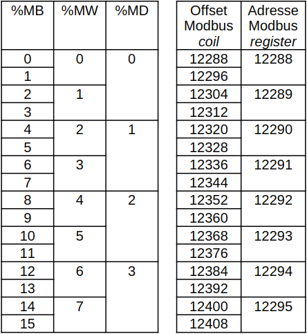

Dans ce cas, c'est un peu particulier, parce que les bits (%MW0.5, par exemple) sont dans la même plage mémoire que
les registres avec une plage d'adresse Modbus commune. Donc la fonction read_coils à l'adresse 12295 lira %MW0.7 tandis
que la fonction read_holding_registers à la même adresse Modbus (12295) lira %MW7.  
C'est une gymnastique qu'il faut essayer d'apprendre, mais tous les appareils ne sont pas gérés de la même manière. La
plupart ne mettent à disposition que des registres numériques à lire avec la fonction read_holding_registers.

***

# Migration de MyModbus

La version stable de MyModbus jusqu'à début 2025 était dépassée. La version bêta qui a été réécrite depuis fin 2023 et
qui donne satisfaction aujourd'hui en terme de fonctionnalité et de stabilité remplace cette ancienne version stable.  
La [documentation de la migration](mymodbus_migration.md) est disponible.

***

# Installation de MyModbus

L'installation se fait via le market, comme tous les plugins Jeedom. Une fois téléchargé, MyModbus installe ses
dépendances, cette étape peut durer plusieurs dizaines de minutes en fonction de la bande passante disponible et des
capacités de votre machine.  
Il est fortement conseillé de désactiver la gestion automatique du démon durant l'installation afin que le démon ne
soit pas démarré par Jeedom sans que MyModbus ne soit installé complètement.

Ici, on peut constater que l'installation de MyModbus bêta sur un Raspberry PI 3B peut durer vraiment longtemps :  
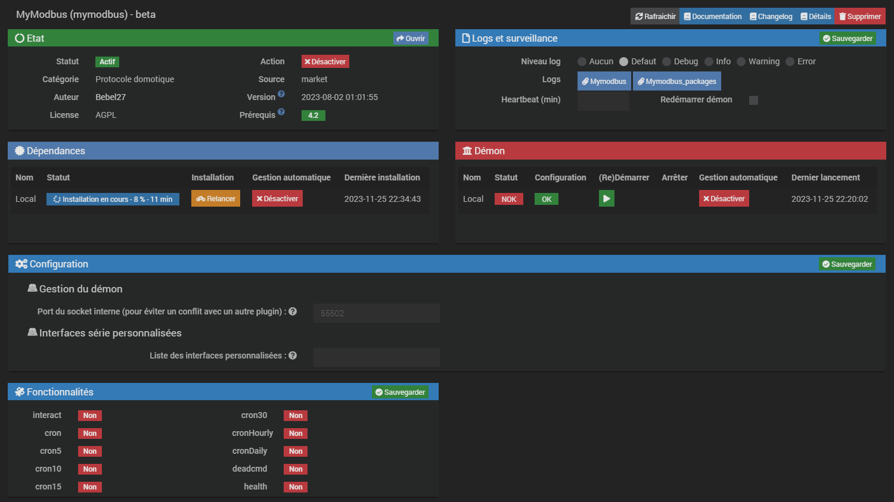

Une fois l'installation terminée, la page de gestion du plugin MyModbus ressemblera à ceci :  
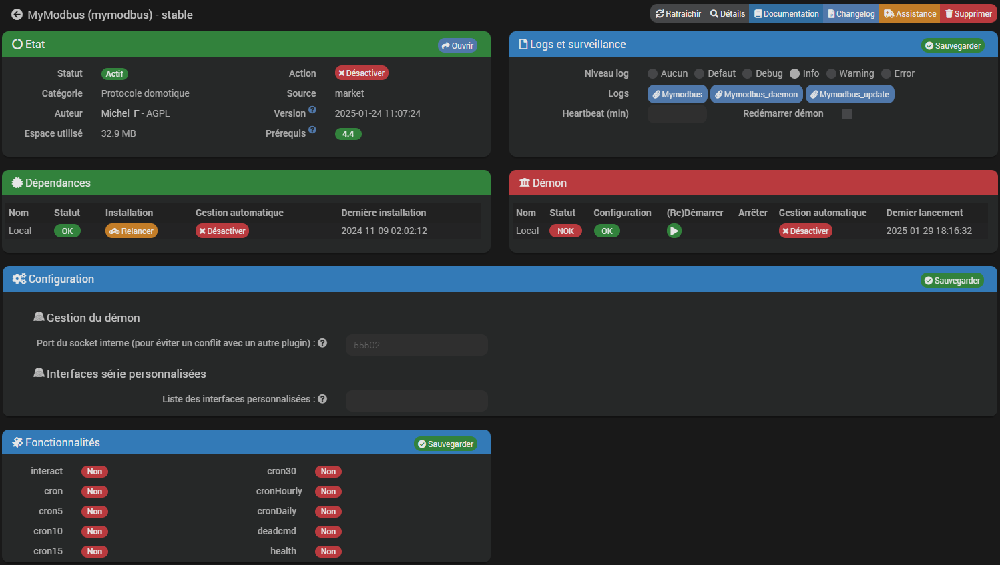

Vous pouvez activer la gestion automatique du démon par Jeedom si vous le souhaitez.

MyModbus lance un démon écrit en Python qui utilise le module [pymodbus](https://pypi.org/project/pymodbus/).  
Dans la documentation de pymodbus, on peut voir que la version minimale requise pour pouvoir l'utiliser est
Python3, de préférence la version 3.11, ne vous inquiétez pas, ce point est géré quelle que soit la version installée
sur votre machine Jeedom.  
Dans la mesure du possible MyModbus utilisera la dernière version stable de pymodbus.

Un jour, j'ai développé le plugin pyenv4Jeedom pour gérer l'installation de la bonne version de python. Ce plugin est
abandonné et peut être désinstallé. MyModbus utilise des bibliothèques développées par Mips, nebz et TiTiDom pour faire
la même chose. Tout est transparent pour l'utilisateur.

***

# Configuration de MyModbus

## Le principe

Pour chaque appareil avec lequel vous souhaitez communiquer en Modbus, il faudra créer un équipement. Cet équipement
contiendra autant de commandes info ou action que vous avez de variables à lire ou à écrire. Les principes de Jeedom
sont respectés. Si vous souhaitez scinder un appareil en plusieurs équipements, c'est possible, il suffit d'utiliser
"Interface d'un autre équipement" pour le deuxième équipement et de choisir l'équipement dont la connexion sera
utilisée :  
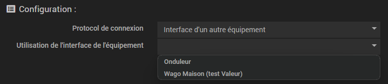

Un outil "Déplacer les commandes", accessible depuis la page de gestion des équipements, permet de déplacer les
commandes entre les équipement partageant la même interface afin de ne pas perdre l'historique ni tous les liens dans
les scénarios et autres, après avoir scinder un équipement. Cet outil ne fonctionne que si les équipements utilisent la
même interface. Il faut donc avoir créé et configuré l'équipement AVANT de vouloir déplacer les commandes.  
Avec cet outil, si une plage de registres est déplacée, toutes les commandes y étant liées sont également déplacées.

Pour chaque équipement, il faut préciser le type de connexion ainsi que les paramètres de cette connexion.

> :memo: ***Remarque***  
> Si vous avez plusieurs appareils en Modbus série et que vous communiquez avec ces appareils via la même interface, il
> faut alors ne déclarer qu'un seul équipement MyModbus et spécifier l'ID de l'appareil serveur dans les
> commandes. D'autres équipements qui utilisent la connexion de cet équipement peuvent être créés pour lire les autres
> serveurs.

Pour chaque commande, il faut préciser les type et sous-type Jeedom ainsi que les paramètres de la requête Modbus.

Il est possible de configurer l'ID pour toutes les commandes de l'équipement en cochant la case "ID du serveur
identique à toutes les commandes" et en précisant l'ID.

Le fait de sauvegarder la configuration lance une validation. Si la configuration est valide, la configuration de
l'équipement est effectivement sauvegardée et le démon est actualisé s'il est démarré.

La configuration se fait via Plugins / Protocole domotique / MyModbus :  
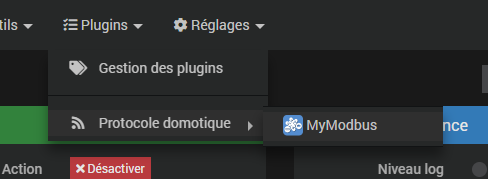

## Configuration du plugin

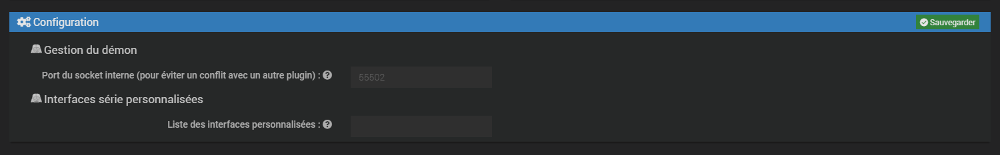

Il est possible de modifier le port de communication interne entre le démon et le core du plugin. Par défaut, ce port
est à 55502 et il est fortement conseillé de ne pas le modifier et de le laisser ce champ vide sauf si ce port est
utilisé par un autre plugin.

> :warning: ***Important***  
> Pour modifier ce port, il faut tout d'abord stopper le démon sans quoi le plugin ne pourra plus communiquer avec le
démon.

Il est également possible de spécifier une ou plusieurs interfaces série personnalisées. Si vous en spécifiez
plusieurs, elles doivent être séparées par des `;` et ne pas contenir d'espace. Les interfaces listées ici seront
affichées dans la liste des interfaces possibles pour un équipement en liaison série à condition que ces interfaces
existent.

## Création d'un équipement 

C'est la première étape. Après l'installation, la configuration est vide :  

En cliquant sur "Ajouter", vous êtes invité à donner le nom de votre équipement et à sélectionner le template. Pour la
documentation, ce nom sera "Equipement MyModbus" et aucun template ne sera utilisé. En validant, vous arrivez à la page
de configuration de l'équipement. Juste après sa création, l'équipement n'est pas configuré :  
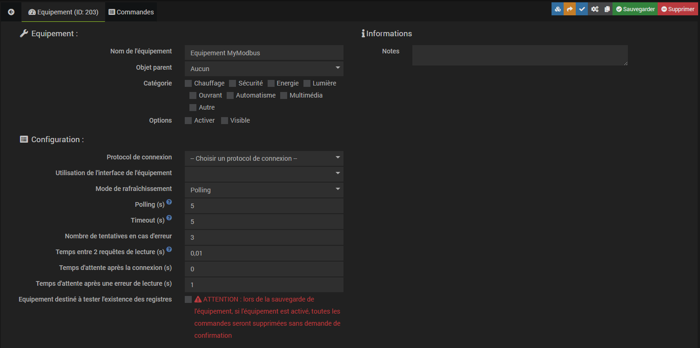

## Configuration d'un équipement

La page de configuration se compose de trois parties :
- **Equipement** : cette partie est pratiquement la même pour tous les équipements des plugins de Jeedom.
Le fait d'activer l'équipement activera le démon pour les commandes de cet équipement, après enregistrement de la
configuration.
- **Configuration** : c'est là que vous configurez la connexion avec votre équipement.
- **Informations** : vous pouvez ajouter vos propres notes afin de documenter votre équipement.

MyModbus gère quatres protocoles de connexion et la connexion partagée :
- **serial** (série) : à choisir pour un équipement communiquant via une liaison série (RS232, RS485, RS422, ...)
*directement* avec votre machine Jeedom. Un seul équipement est défini dans MyModbus pour chaque interface série,
même si plusieurs serveurs (avec chacun son ID) se trouvent sur le bus série. L'ID du serveur est à renseigner dans les
commandes.
- **tcp**, **udp** et **rtuovertcp** : Connexion via le réseau Ethernet
- **Interface d'un autre équipement** : Permet d'utiliser la connexion définie dans un autre équipement si l'appareil
ne supporte pas plusieurs connexions simultanées depuis la même source. C'est notamment le cas des connexions série.

> :warning: ***Important***  
> Si vous avez des appareils Modbus reliés à une paserelle IP/série et que votre machine Jeedom communique avec la
> passerelle, il faudra choisir une liaison réseau et configurer la liaison vers la passerelle. Dans ce cas l'ID
> du serveur doit être renseigné dans les commandes.

> :memo: ***Remarque***  
> Le module pymodbus gère la connexion et la rétablit si elle est perdue.

Il est possible de configurer le rafraichissement de 3 manières :
- **Polling** : temps en secondes qui correspond au temps entre le début des cycles de lecture des commandes info,
- **Cyclique** : pas de temps de pause entre les requêtes de lecture,
- **Sur événement** : les lectures sont lancées lorsque la commande action "Rafraîchir" est exécutée.

La valeur minimale de polling acceptée par MyModbus est de 0,01 seconde. Une valeur conseillée serait de l'ordre de 10
secondes de plus que le temps de rafraichissement. Un polling bas, c'est-à-dire des lectures très fréquentes, induit
une grande quantité de données à historiser. Prenez garde à ce point et gardez en tête que l'enregistrement des valeurs
toutes les 10 secondes ne génère que du bruit sur une courbe journalière ou hebdomadaire.  
Si le temps de polling est configuré trop faible par rapport au temps nécessaire pour la lecture de tous les registres,
le temps de polling est réajusté par le démon sans modifier la configuration. Cette valeur est sauvegardée dans la
commande info "Polling" créée automatiquement lors de la première sauvegarde.

"Timeout" est le temps en secondes durant lequel une réponse à la requête est attendue par le module pymodbus. Si ce
temps est dépassé sans réponse, la requêtes est renvoyée. Ceci se produit autant de fois que configuré dans "Nombre de
tentatives en cas d'erreur". Si après ce nombre de fois l'appareil n'envoie toujours pas de réponse à la requêtes, la
commande info "Cycle OK" est passée à 0 et la prochaine requête est envoyée.  
La commande info "Cycle OK" repasse automatiquement à 1 dès qu'un cycle de lecture complet est fait sans erreur,
c'est-à-dire une fois que toutes les commandes info nécessitant une requête de lecture sont sans erreur.

"Temps entre 2 requêtes de lecture" est le temps d'attente entre la réception d'une réponse et l'envoi d'une nouvelle
requête. Ce temps peut être mis à 0 dans la plupart des cas, il est surtout utile pour des connexions lentes,
typiquement des connexions série. Il faut savoir qu'un temps d'attente de 0.03 s est mis en place par le module
pymodbus pour les connexions série. Ce temps se rajoute au temps d'attente du plugin.  
Ce temps est le temps que le démon attend après chaque requête de lecture pour se donner le temps de vérifier si des
commandes action ont été déclanchées et pour laisser des resources à l'exécusion des autres équipements.

Le "Temps entre la connexion et la première requête" peut être mis à 0 si le paramètre peut être ignoré. Pour certains
appareils, il faut configurer une pause entre la connexion et la première requête. Pour l'onduleur SUN2000 de Huawei,
par exemple, ce temps est à configurer à 1 seconde minimum.

Le "Temps d'attente après une erreur de lecture" n'a pas besoin d'être expliqué, son nom est assez claire.

Les écritures déclenchées par les commandes action sont effectuées dès que les resources de la machine Jeedom le
permettent.

La commande "Temps de rafraîchissement" est actualisée tous les 5 cycles de lecture complet quel que soit le mode de
rafraîchissement.

Les commandes créées par le plugin, à savoir "Temps de rafraîchissement", "Polling", "Rafraîchir" et "Cycle OK" ne
peuvent pas être supprimées.

### Cas d'une connexion série

Une connexion série non configurée se présente comme ceci :  
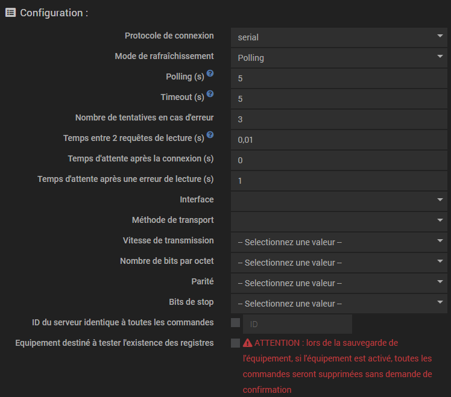

L'interface correspond au point de connexion de la liaison série sur votre machine Jeedom. Jeedom propose une liste
d'interfaces standards en fonction du modèle de votre machine. En plus de ces interfaces, MyModbus propose les
interfaces série disponibles sur la machine. Les indications de
[cette page](https://www.baeldung.com/linux/all-serial-devices) peuvent vous être utiles pour retrouver quelle
interface utiliser.

> :memo: ***Remarque***  
> Il se peut que les interfaces proposées par MyModbus soient redondantes avec celles proposées par Jeedom et que la
> sélection soit différente une fois que vous avez sauvegardé et rechargé cette page. Ne vous inquiétez pas, cela
> signifie seulement que l'élément sélectionné pointe vers la même interface que celle que vous avez enregistrée, mais
> cette entrée apparaît, dans la liste, avant l'entrée que vous avez selectionnée.

Les autres paramètres sont à aligner avec la configuration décrite dans la documentation constructeur de votre appareil.

Voici un exemple de configuration série :  
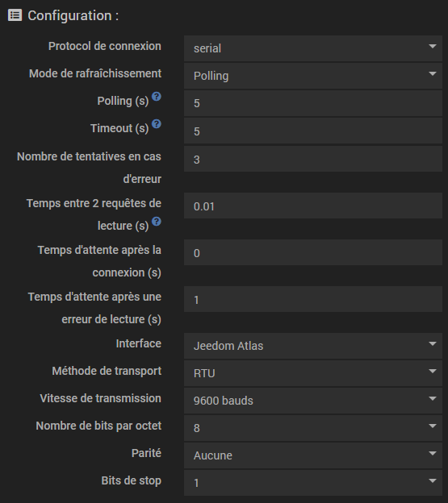

### Cas d'une connexion TCP, UDP ou RTUoverTCP

Une connexion TCP non configurée se présente comme ceci :  
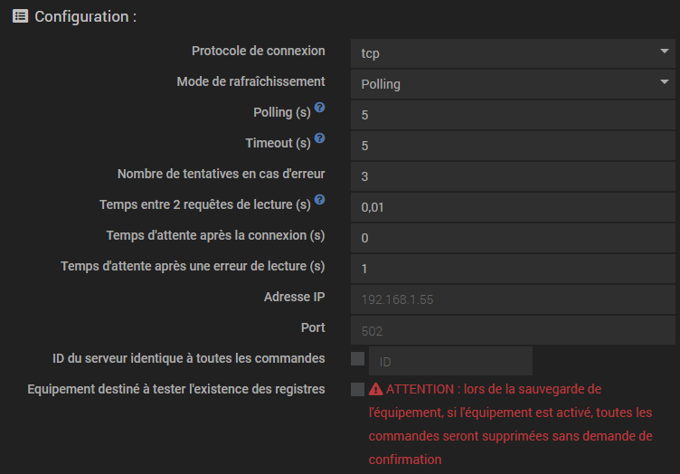

Ici la configuration est simple : il suffit de renseigner l'adresse IP de l'appareil et le port à utiliser. Sauf cas
particulier, le port est le 502.

Ce sont les mêmes paramètres qui sont à renseigner pour les connexions UDP ou RTUoverTCP.

### Cas d'une connexion (série) avec plusieurs appareils

Dans ce cas, chaque appareil doit être configuré pour avoir un ID différent. Il est possible de regrouper toutes les
commandes dans un équipement ou de faire un équipement par appareil.  
Dans ce dernier cas, il est nécessaire de ne configurer la connexion que pour un seul équipement et d'utiliser le
protocole de connexion **Interface d'un autre équipement** pour les autres équipements et de choisir d'utiliser la
connexion de l'équipement configuré.

Pour les appareils avec une connexion par le réseau (TCP ou UDP), il n'est pas nécessaire d'utiliser la connexion d'un
autre équipement sauf pour des appareils qui n'acceptent qu'une connexion.  
Pour les connexions sur un bus série, l'interface partagée est le seul moyen de communiquer avec plusieurs équipements
avec la même interface série.

### Equipement de test de registres

Si la case "Equipement destiné à tester l'existence des registres" est cochée, l'équipement fonctionne de manière
singulière. Seule la commande action "Rafraîchir" est créée ainsi que les commandes info correspondant aux registres à
tester.

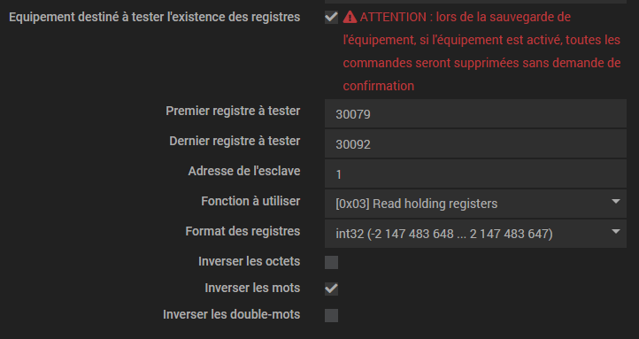

Le message est clair : lors de la sauvegarde de l'équipement, si l'équipement est activé, toutes les commandes seront
supprimées sans demande de confirmation.

Dans ce cas, toutes les commandes info sont systématiquement supprimées lors de la sauvegarde et les commandes
nécessaires sont automatiquement créées. Ici un exemple qui correspond à la capture précédente :

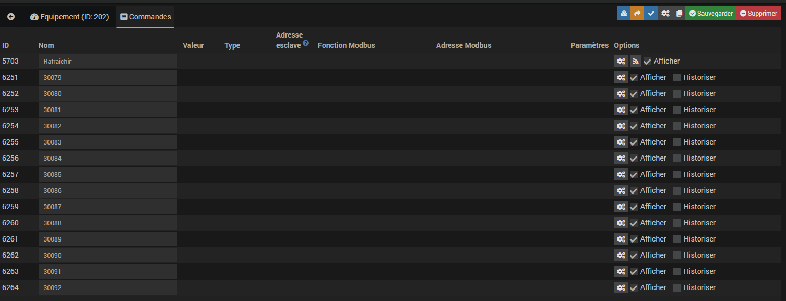

Si le démon est démarré et l'équipement activé, le test de la commande de rafraichissement lance un cycle de lecture
des registres à tester.  
Le résultat de la lecture des registres est affiché :

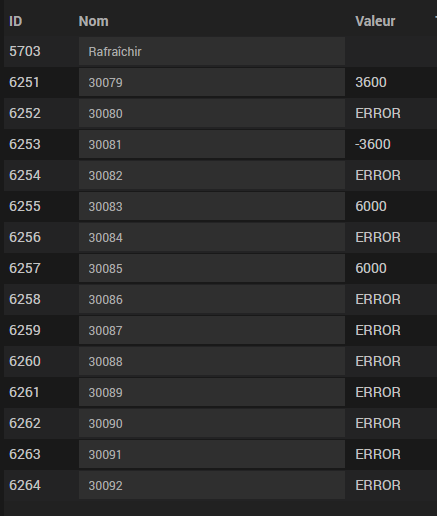

## Création et configuration des commandes

> :bulb: ***Conseil***  
> Il vous est conseillé d'enregistrer la configuration de MyModbus **sans activer l'équipement** avant de commencer le
> paramétrage des commandes. De cette manière, la configuration de la connexion sera sauvegardée mais Jeedom n'essaiera
> pas de démarrer le démon.

> :memo: ***Remarque***  
> Si vous utilisiez une ancienne version de MyModbus, la nouvelle version garde les commandes et vous "propose" une
> configuration équivalente. Il est cependant vivement conseillé de remplacer le type de variable 'uint16' associé au
> calcul qui permet de lire les valeurs négatives par le type de variable 'int16' sans calcul.  
> De manière générale, il vaut mieux revoir la configuration complète en détail.

Après la création d'un équipement, la liste des commandes est vide (à part les 4 commandes créées par le plugin).

Pour créer une nouvelle commande, il faut cliquer sur le bouton "Ajouter une commande". La nouvelle commande est
ajoutée à la fin de la liste et peut être déplacée avec un cliquer-déplacer.

Vous pouvez commencer par donner un nom à la commande et définir s'il s'agit d'une commande info ou action. Si une
commande n'a pas de nom, la configuration n'est pas enregistrée.

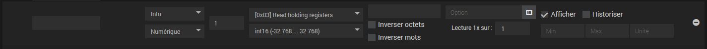

### Sous-type

Pour **les commandes info**, les trois sous-types proposés par Jeedom peuvent être utilisés :  
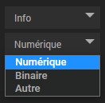

| Type de registre     | Sous-type |
| -------------------- | --------- |
| bit                  | Binaire   |
| int, uint ou float   | Numérique |
| chaine de caractères | Autre     |

Pour **les commandes action**, les cinq sous-types proposés par Jeedom peuvent être utilisés :  
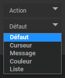

| Type de registre     | Sous-type        |
| -------------------- | ---------------- |
| bit                  | Défaut / curseur |
| int, uint ou float   | Défaut / curseur |
| chaine de caractères | Défaut / message |

### ID du serveur

Si la commande correspond à un registre dans un serveur sur un bus série d'une connexion série directe ou derrière
une passerelle IP/série, vous devez renseigner l'ID du serveur sur le bus Modbus. Sinon vous pouvez laisser "1".

> :memo: ***Remarque***  
> Sur l'ancienne version du plugin, ce paramètre s'appelait "Unit ID" et était à configurer dans l'équipement.

### Fonction Modbus

Choisissez la fonction Modbus à utiliser pour la lecture ou l'écriture du registre. Normalement, la fonction à utiliser
est documentée par le constructeur. Si ce n'est pas le cas, faites appel à votre logique et faites des essais (bon
courage !).

> :memo: ***Remarque***  
> Seules les fonctions compatibles avec le type et le sous-type sont proposées. Attention donc à bien sélectionner la
> fonction de la commande après avoir modifié le type ou le sous-type. Si vous oubliez, la vérification au moment de
> l'enregistrement génèrera une erreur et invalidera la sauvegarde.

### Codage du registre et adresse des registres Modbus

Pour comprendre cette partie, il faut un peu de théorie :  
> Les registres sont des mots de 16 bits. Les variables sont codées sur un ou plusieurs registres en fonction de leur
> taille. Afin de pouvoir interpréter les données correctement, le codage de ces données doit être connu par le démon
> MyModbus. En fonction de la plage de la valeur à coder, le type de variable peut changer. Le codage est soit donné
> dans la documentation, soit à déduire des données de la documentation.

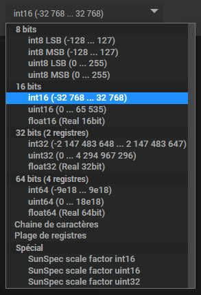

| Codage               | Type de variable          |
| -------------------- | ------------------------- |
| int                  | Entier signé              |
| uint                 | Entier positif            |
| float                | Nombre flottant (réel)    |
| chaine de caractères | Chaine de caractères      |
| plage de registres   | Plage de registres        |
| SunSpec scale factor | Type spécifique à SunSpec |

Pour les types int, uint et float, le démon MyModbus lira le bon nombre de registres en fonction du nombre de bits sur
lesquels sont codées les variables. L'adresse de ces variables doit être un nombre.

Pour une chaine de caractères, l'adresse doit être renseignée comme ceci : 'adresse_début [longueur]'.
Par exemple '20406 [32]' pour une chaine de caractères de 32 caractères qui commence à l'adresse 20406.

Une plage de registres correspond à un groupe de plusieurs registres à lire en une requête. Le format de l'adresse est
le même que pour une chaine de caractères à savoir 'adresse_début [longueur]'. La nombre maximal de registres lisibles
en une requête dépend du matériel et est généralement documenté. Une commande de ce type prend une valeur '1' si la
requête est exécutée sans erreur. Sinon elle prend la valeur '0'.  
Pour extraire une valeur de cette plage de registres, les autres commandes doivent être configurées avec une requête
'Depuis une plage de registres'. La commande qui lit la plage concernée est à sélectionner et le champ d'adresse est
identique à ce qui doit être configuré pour une commande standard.  
Attention à faire en sorte que le registre soit effectivement dans la plage de lecture sans quoi la sauvegarde sera
invalidée et vous devrez corriger la configuration.

> :memo: ***Remarque***  
> Une communication Modbus avec un minimum de requêtes est bien plus performante et moins gourmande en ressources si
> le nombre de requêtes est limité au minimum. Il est vivement conseillé d'utiliser les plages de registres, même si
> une plage est définie juste pour 2 ou 3 commandes.

> :warning: ***Important***  
> Il arrive que la lecture de certaines adresses soit interdites et provoque une erreur. Ces adresses ne doivent pas
> être lues dans des plages de registres.

Dans les appareils utilisant la norme SunSpec, certaines mesures sont codées avec deux registres :
'registre1 * 10^registre2'. Pour ces types de variable, l'adresse doit être renseignée comme ceci :
'registre1 sf registre2', par exemple '40036 sf 40045'. 'sf' pour 'scale factor'. Si la puissance de 10 se trouve à
une adresse avant celle de la valeur ('40223 sf 40210' par exemple) MyModbus adapte la requête.

> :memo: ***Remarque***  
> Les 'scale factor' auraient pu être lus en deux commandes et calculés via un virtuel.
> Comme SunSpec est une norme assez largement utilisée, il a été décidé d'inclure ce type spécial puisqu'il pourrait
> être utilisé dans différents appareils. Si d'autres types spéciaux devaient être inclus dans MyModbus, vous pouvez en
> faire la demande sur le forum Community en précisant bien le tag `#plugin-mymodbus`.

### Inverser les octets, les mots ou les double-mots

Si les données lues sont incohérentes, il se peut que cela soit du au fait que les octets, les mots ou les doubles-mots
soient inversés dans la mémoire de l'appareil. Ceci est lié au type de processeur utilisé et peut être corrigé en
cochant la bonne configuration. C'est la différence entre "little endian" et "big endian". Le même format que le
processeur de la machine Jeedom est utilisé par défaut. Si la case est cochée, le format est inversé. Attention donc à
ce point si vous partagez un template d'équipement.

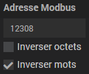

### Paramètres d'une commande info

Deux champs de paramétrage sont proposés :
- l'option de calcul
- "Lecture 1x sur"

L'option de calcul permet d'appliquer un calcul à la valeur retournée par le démon. Cette option peut être utile pour
une mise à l'échelle ou le filtrage d'un bit. Vous pouvez mettre dans ce champ le calcul que vous voulez, il suffit de
saisir '#value#' et de respecter la syntaxe de php. Toutes les fonctions mathématiques de php sont disponibles.  
Exemple : '(#value# + 7) * 3'  
Si vous souhaitez extraire un bit d'un registre de 16 bits (préférablement de type uint16), vous pouvez utiliser la
fonction d'aide en cliquant sur l'icône  à droite du champ de saisie afin
d'appeler la fenêtre suivante :  
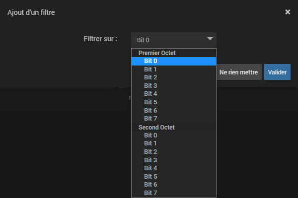

> :bulb: ***Astuce***  
> Si vous voulez tester si un registre vaut 77, il suffit de créer une commande info de sous-type binaire qui lit le registre
> à tester comme un registre numérique mais avec `#value# == 77` dans le champ option.
> Le test *différent* fonctionne aussi avec `!=`.

> :warning: ***Attention***  
> Le champ option ne doit pas contenir de ';' (point-virgule) sinon la sauvegarde est invalidée.

L'option "Lecture 1x sur" permet de ne pas lire ce registre lors de tous les cycles de polling mais une fois tous les
X cycles. Cela permet de limiter les requêtes de lecture sur des données statiques, comme un numéro de série par exemple,
et de ne pas surcharger la communication inutilement.

### Paramètre d'une commande action

Le seul paramètre est la valeur à écrire. Là aussi, MyModbus utilise les fonctions de Jeedom, vous pouvez donc :
- saisir une valeur (ou un texte pour les commandes du sous-type "Message") qui sera toujours écrite
- saisir '#slider#' pour les commandes du sous-type "Curseur"

Si la commande action est liée à une commande info (qui relit la valeur), il est possible d'utiliser cette valeur lue
en utilisant `#value#`.

Une autre particularité de MyModbus, c'est qu'il est possible de rajouter un temps de pause durant lequel aucune
écriture ne se fera pour cet équipement. Pour cela, dans le paramètre "valeur", il faut écrire : 'valeur pause
temps_de_pause'. Par exemple '1 pause 2.5' pour écrire '1' et attendre 2.5 secondes.  
Ceci est utile quand on veut créer une impulsion :
- une commande action écrit 1 et attend une seconde puis lance une seconde commande action (action après éxécution de 
la commande)
- une seconde commande action qui remet le bit à 0

> :memo: ***Remarques***  
> 1. Pour les actions, les variables sur 8 bits sont ignorées sans avertissement.
> 2. Le démon génèrera un 'Warning' pour les commandes action des types de variable SunSpec dont les adresses ne sont
> pas concécutives et ignorera la requête afin d'éviter de supprimer les registres qui se trouvent entre les deux
> registres paramétrés.

### Etat

Dans cette colonne, vous pouvez visualiser quelle est la valeur des commandes info.

### Options

Les options standards de Jeedom.

## Optimisation du nombre de requêtes à l'aide des plages de registres

Si les registres à lire sont assez regroupés, il est vivement conseillé d'utiliser les plages de registres afin de
limiter le nombre de requêtes et donc le temps d'exécution d'un cycle de lecture et la charge CPU de la machine Jeedom
pour la gestion des lectures.

Le gain en temps d'exécution est énorme pour tous les types de connexion.

Imaginons que sur un équipement vous vouliez lire plusieurs adresses entre 40000 et 40120, que dans cette plage toutes
les adresses sont lisibles (parfois il y a des trous dans les tables d'adresses avec des adresses qu'il est impossible
de lire et dont la tentative de lecture génère une erreur). Il est possible de définir une plage de registres à lire
une seule fois et d'y faire référence dans les commandes info qui l'utilisent. On peut définir plusieurs plages de
registres.

Plus simplement : on lit tout une plage et on vient piocher dans cette plage les valeurs dont on a réellement besoin.

Ici un exemple :  
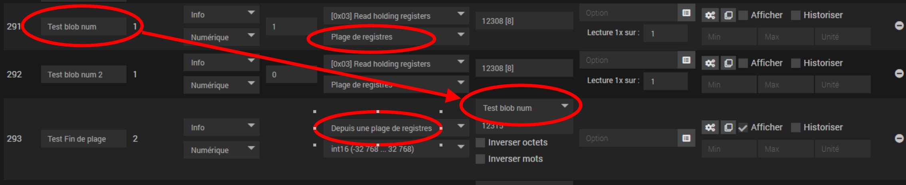

Dans cet exemple, la commande avec l'ID 291 lit une plage de 8 registres à partir de l'adresse 12308, donc jusqu'à
l'adresse 12315.  
La commande avec l'ID 293 utilise le registre 12315 en ne lançant pas de nouvelle requête de lecture mais en piochant
dans la plage de l'ID 291.  
C'est une sorte de cache de lecture.

L'utilisation de plages de registres dans un équipement MyModbus dépend de la compatiblité du matériel et du nombre de
registres lisibles en une requête. Certains appareils sont en effet limités.

La valeur d'une plage de registres est 1 si la lecture n'a pas généré d'erreur, sinon 0. Les log vous donneront des
indications sur la raison de l'erreur de lecture.

## Sauvegarde d'un équipement

Au moment de la sauvegarde d'un équipement et de ses commandes, la cohérence des paramètres est vérifiée. En cas
d'erreur, la sauvegarde est invalidée et un message apparaît avec l'erreur.  
La première ligne du message correspond au nom de l'équipement si l'erreur est sur l'équipement ou au nom de la
commande qui a une erreur. Les messages sont assez explicites et les erreurs doivent être corrigées pour que la
sauvegarde soit possible.

Exemple d'erreur sur la configuration de l'équipement 'Equipement MyModbus' :  

Exemple d'erreur sur la configuration de la commande 'Température extérieure' :  

***

# Templates

Si vous pensez avoir un template intéressant pour d'autres utilisateurs Jeedom qui auraient le même appareil que vous,
vous pouvez :
- le proposer sur le [community de Jeedom](https://community.jeedom.com/) en précisant l'étiquette `#plugin-mymodbus`
pour que je sois prévenu,
- faire une PR sur le [dépôt github de MyModbus](https://github.com/MrWaloo/jeedom-mymodbus).  

De cette manière la bibliothèque s'étoffera.

***

# En cas de problème

En cas de problème d'utilisation du plugin, vous pouvez poster sur le
[community de Jeedom](https://community.jeedom.com/).
En précisant l'étiquette `#plugin-mymodbus` je serai prévenu, inutile de me tagger. Je consulte régulièrement le
community, vous ne devriez donc pas attendre trop longtemps pour avoir une réponse.

## Problème d'installation du plugin

Dans votre post, il faut poster :
- une capture de la page santé de Jeedom,
- le contenu du log `mymodbus_update`,
- le contenu du log `mymodbus` en mode debug.

Et bien évidemment mettre un maximum d'informations.

## Problème d'utilisation

Si vous n'arrivez pas à vos fins et que vous avez besoin d'aide pour la configuration de MyModbus, assurez-vous d'avoir
la dernière version stable ou bêta selon votre choix.

Commencez un nouveau fil de discussion en précisant l'étiquette `#plugin-mymodbus` et donnez :
- un maximum de détails sur le matériel et ce que vous souhaitez faire,
- la documentation des registres Modbus,
- la configuration de l'équipement et des commandes soit avec des captures, soit avec un export du template,
- les essais que vous avez faits,
- les résultats de ces essais avec les log `mymodbus` et surtout `mymodbus_daemon` en mode debug correspondant.

Ca fait beaucoup de choses, mais sans tout cela, il est difficile de vous venir en aide.

## Problème du plugin

Il se peut que le plugin ne fonctionne pas correctement, dans ce cas, il vous est possible de rapporter les erreurs sur
le [community de Jeedom](https://community.jeedom.com/) dans un fil de discussion dédié ou de poster une *issue* sur le
[dépôt github de MyModbus](https://github.com/MrWaloo/jeedom-mymodbus).  
Libre à vous de proposer ou non une PR de correction que j'étudierai.
